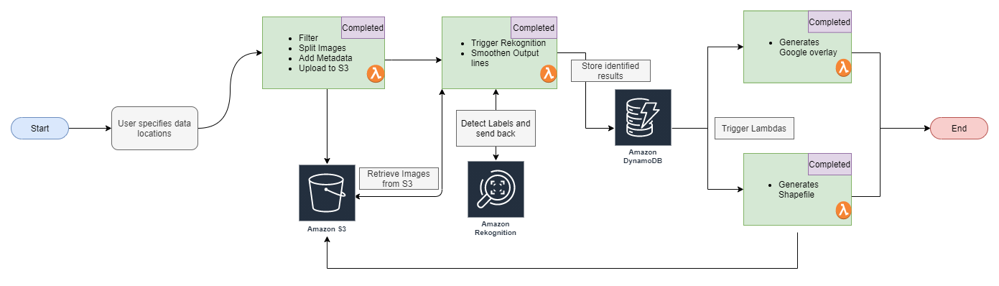
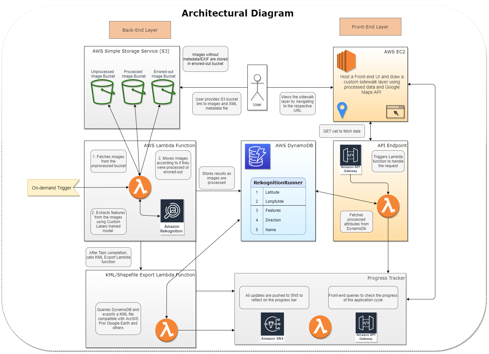
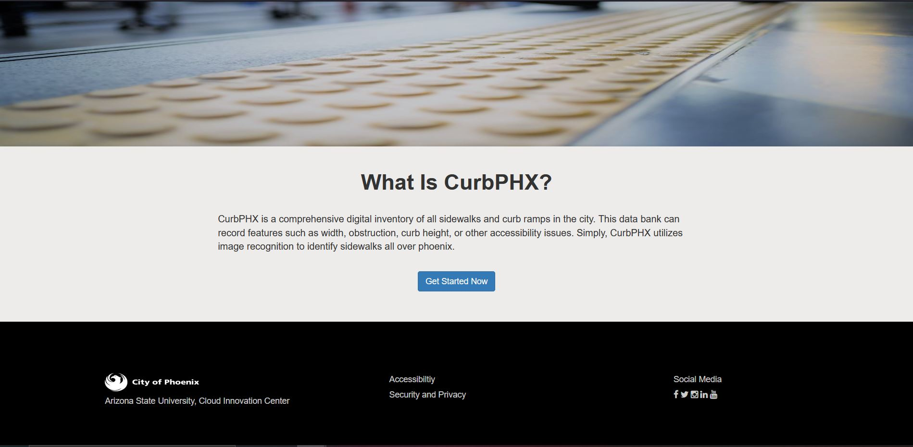
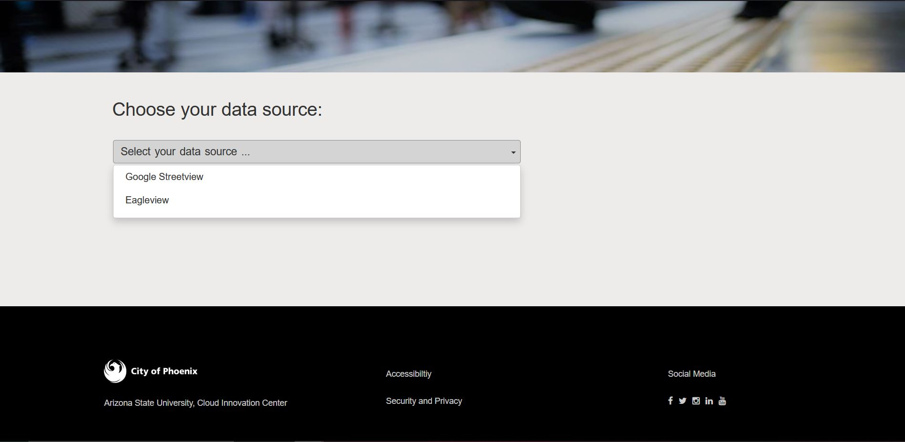
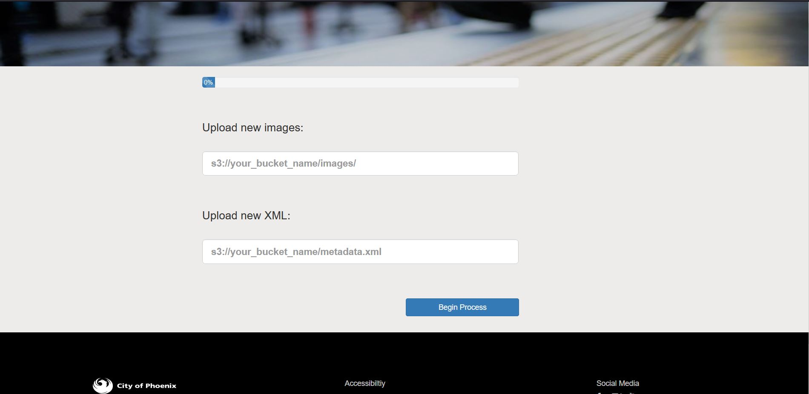
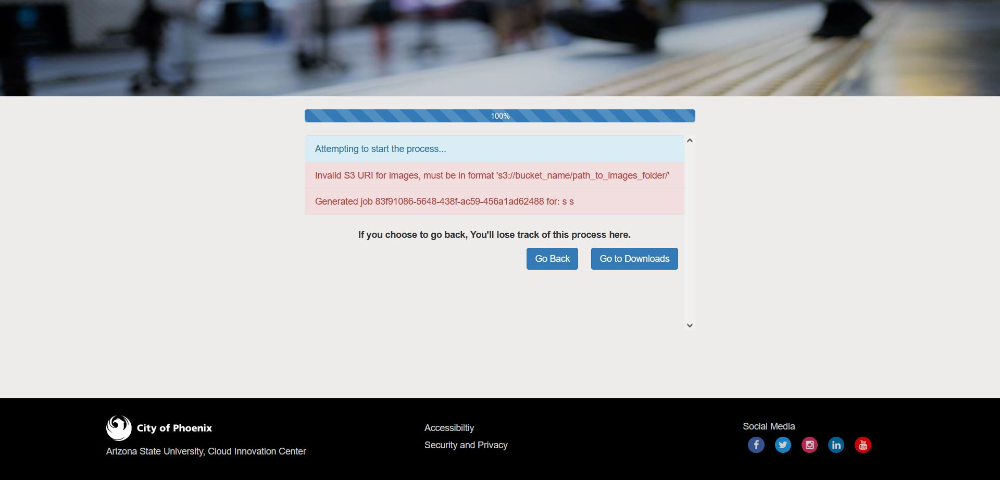
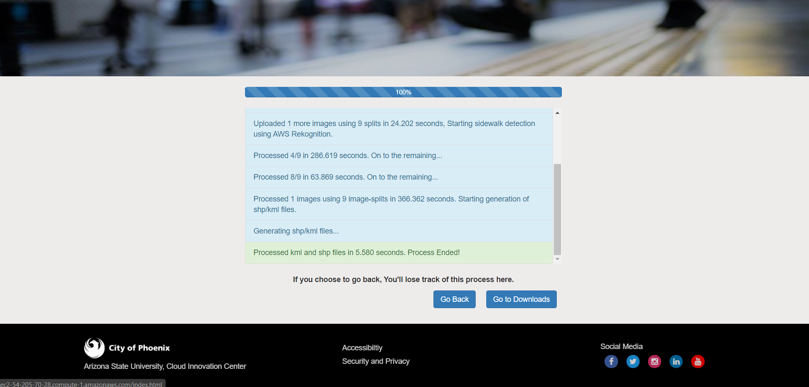
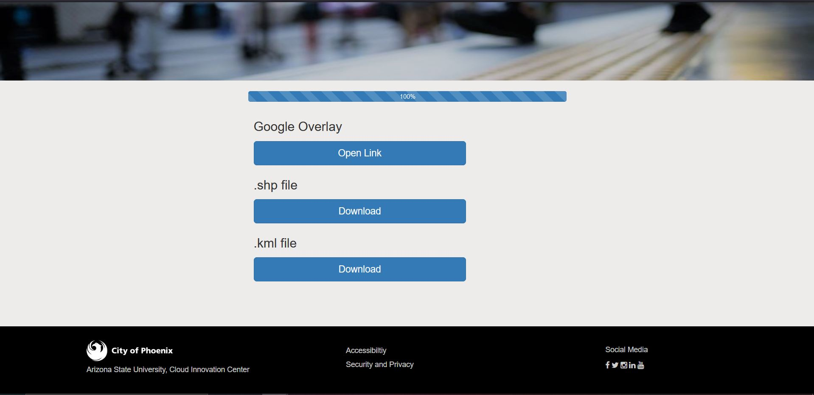

CurbPHX

|Index| Description|
|:----------------|:-----------|
| [Overview](#overview)         |     See the motivation behind this project.    | 
| [Description](#description)         |     Learn more about the problem, implemented solution and challenges faced.    | 
| [Deployment Guide](#deployment-guide)         |    How to install CurbPHX architecture. |
| [How to Use](#how-to-use)       |     Instructions to use CurbPHX.   |
| [Credits](#credits)      |     Meet the team behind this.     |
| [License](#license)      |     License details.     |

# Overview
The City of Phoenix and the [Arizona State University Smart City Cloud Innovation Center Power by AWS](https://smartchallenges.asu.edu/)(ASU CIC) are coming together to develop a complete sidewalk data inventory. A sidewalk inventory is a data bank with a collection of attributes about the sidewalk, including height, width, condition, existence of ramps and curb cuts and the presence of obstructions such as street furniture. The City of Phoenix will use this data to better understand and improve pedestrian mobility and safety and improve curb and sidewalk management.  

# Description

## Problem
As one of the the fastest growing cities in the United States, Phoenix has a constant need to update its sidewalk inventory to include new developments. The City has the opportunity to expand the data sets used to understand the location and condition of sidewalks and curb ramps. Access to sidewalk data makes it possible to identify and prioritize funding for infrastructure investments. A sidewalk data layer supports the ability to measure the impact of projects on the City’s sidewalk and ramp network. Residents and staff also benefit from an ability to provide input on hazards identified on the sidewalks. A sidewalk layer also helps to identify areas of need and support the use of mobility resources.

## Approach
Working together, the City of Phoenix and the CIC envisioned a new solution: CurbPHX. CurbPHX is a comprehensive digital inventory of all sidewalks and curb ramps in the city. This data bank can record features such as width, obstruction, curb height, or other accessibility issues. 

An initial data set composed of images of sidewalk and curbs will be constructed and further data will be crowdsourced from the citizens themselves as areas needing improvement in their community are identified. The ASU CIC envisions a machine learning and geographic information system (GIS) framework that can process the high amounts of data. With the ability to collect, analyze, and store data on Phoenix’s sidewalk network, the City of Phoenix will be able to effectively identify areas that need repair and improve pedestrian safety and mobility. 

## Architecture Diagram

High-level overview of the application

Detailed Architectural diagram

## Functionality 
Given a set of aerial imagery, a image recognition model is trained using a subset of high quality feature rich images to detect types of sidewalks viz. attached, detached and no sidewalk regions. We generate an inventory for sidewalks for the given city by filtering, parsing and extracting features out of the imageset using Amazon Web Services. The final output is rendered on google maps overlay and as a shapefile to use on ArcGIS pro.  

## Technologies
Using Python as our base language, we used the following technology stack to implement our system.

1. Amazon Web Services ->
    - Lambda functions and layers
    - DynamoDB
    - Amazon Rekognition
    - Simple Storage Service
    - Simple Notification Service
    - Virtual Private Cloud
    - Elastic Compute Cloud
2. GIS ->
    - GeoPandas and Shapely for Python
    - ArcGIS/ ArcGIS Pro
3. Exploratory Data Analysis using Python Notebooks

## Assumptions
Except that fact that this system was designed, built and tested on Amazon Web Services, following are the requirements,
1. User should have access to at least 500 images with 250 images per label to train an AWS Rekognition model, these images can be obtained from Google Streetview or Aerial imagery providers (Eagleview, NearMap, etc.)  
2. Images are uploaded on to a public S3 bucket
3. A metadata file, in XML format needs to be included, if your Image provider was Eagleview, they will provide you this out of the box but if you're using a different provider, you might want to generate your own version.
4. Image metadata XML tree should have the following structure:
root -> "Block" -> "Photo" (one for each image included in the bucket) -> "Id", "ImagePath" (it is the filename), "ProjectedCorners" (latitude and longitude coordinates in ECEF system )(EPSG:4978), "Pose" (Rotation metrics, not mandatory).

## Future Enhancements
1. Make the system scalable, more efficient and cost friendly
2. Implement Image segmentation instead of bounding boxes for better edge detection 
3. Improve the dashboard to incorporate more control over the backend
4. Ability to pause/resume an image detection session

## Limitations
1. The crux of our system is AWS Lambda, which is designed for short-term jobs and hence there is a limit of 15 minutes. To work around this, we only upload one image everytime the process is run, which then splits it up into 9 smaller parts which are then consumed by the image recognition service. 
2. Moving to an Auto-scalable infrastructure will increase performance and reduce costs
3. Drawing the sidewalks detected on the image to a map accurately and smoothly is a challenge, keeping in mind to remove the false positives, an expertisee in GIS can solve this problem

# How to use

## AWS Rekognition - Image Recognition model
Check this 

1. Home page

2. Allows user to select between Google Streetview feature or Eagleview which allows user to upload new images and run it across AWS Rekognition

3. After Eagleview is select, the user has to specify the S3 upload links for images and a xml which contains metadata 

4. Once the images and xml file have been uploaded the images will be processed.
If the links are not valid or if there is any issues

If the links are valid and all the process are successfull the download button will appear

5. There are three options to view the data, either by using the Google Street View overlay, .shp files that can be used with ArcGIS or .kml file

The data in Google Street View:

The user can download the files by clicking on the respective download buttons

# Credits

"CurbPHX" is an open source software. The following people have contributed to this project.

**Developers:**  
[Soham Sahare](https://www.linkedin.com/in/sohamsahare11/)
[Krishna Teja Kalaparty](https://www.linkedin.com/in/krishna-teja-kalaparty-a073b5195/)
[Yug Gulati](https://www.linkedin.com/in/yug-gulati/)

**UI Designer:** 
[Nilo Exar](https://www.linkedin.com/in/nilo-exar-16a27b146/)
[Sarah Vue](https://www.linkedin.com/in/sarahvue/)

**Sr. Program Manager, AWS:**  [Jubleen Vilku](https://www.linkedin.com/in/jubleen-vilku/)

**Digital Innovation Lead, AWS:** [Jason Whittet](https://www.linkedin.com/in/jasonwhittet/)

**General Manager, ASU:** [Ryan Hendrix](https://www.linkedin.com/in/ryanahendrix/)

This project is designed and developed with guidance and support from the [ASU Cloud Innovation Center](https://smartchallenges.asu.edu/) and the [City of Phoenix, Arizona]() teams. 
